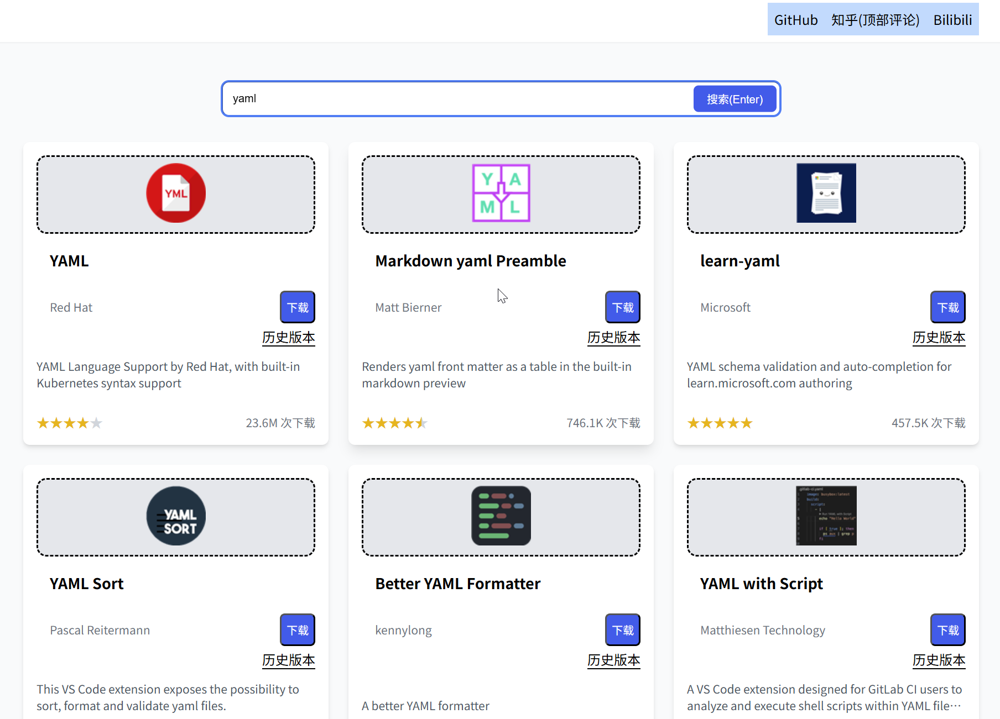

# Vscode extension downloader
简单纯粹的vscode插件下载网站。  
https://vsc-extension.dreamsoul.cn/  


## 更新日志
[2025-10-14] 添加查询参数，便于直接分享url  
[2025-10-13] 版本号处显示发布日期  
[2025-9-3] 可选择不同平台(比如xml这个插件有win也有  linux)  
[2025-7-4] 历史版本下载  
[2025-6-9] 初步完成  
## 开发
使用main作为开发分支，product作为发布分支。  
dist中的源码由构建系统生成，并无什么意义，然而需要分支中有源文件，因此出此下策。
```shell
# 主分支开发好后，执行构建
pnpm build
# 需要手动修改dist/index.html中的标题为`vsc插件下载`
# 切换到product分支
git switch product
# powershell的rm命令比较残废，使用rimraf替代
rimraf index.html static/
mv dist/* .
# 后续推送到远程
```