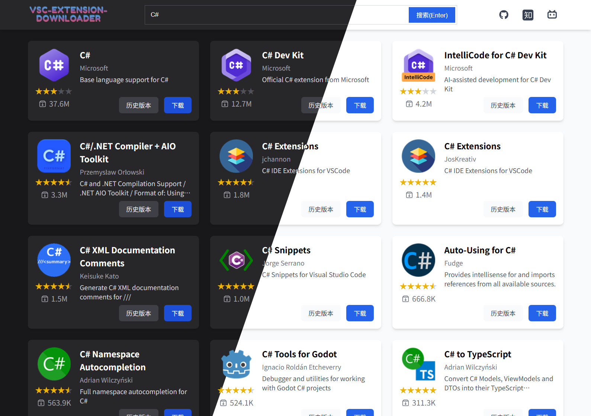

# VSCode Extension Downloader

简单纯粹的 VSCode 插件下载网站。

🌐 **在线访问**: https://vsc-extension.dreamsoul.cn/



## ✨ 功能特性

- 🔍 **插件搜索**: 快速搜索 VSCode 扩展市场中的插件
- 📦 **直接下载**: 无需登录，直接下载 `.vsix` 安装包
- 🌙 **深色模式**: 支持浅色/深色主题切换
- 📜 **历史版本**: 支持下载插件的所有历史版本
- 🖥️ **多平台支持**: 可选择不同平台/架构版本（Windows、Linux、macOS 等）
- 🔗 **URL 分享**: 支持查询参数，可直接分享搜索结果链接
- 📅 **版本信息**: 显示版本发布日期，方便选择合适版本

## 🛠️ 技术栈

- **框架**: SolidJS
- **构建工具**: Rsbuild
- **样式**: UnoCSS
- **语言**: TypeScript

## 📦 快速开始

安装依赖
```shell
pnpm install

# 启动开发服务器
pnpm dev

# 构建生产版本
pnpm build
```

## 🔧 开发说明

使用 `main` 作为开发分支，`product` 作为发布分支。  
`dist` 中的源码由构建系统生成，并无什么意义，然而需要分支中有源文件，因此出此下策。

### 发布流程

```shell
# 主分支开发好后，执行构建
pnpm build
# 切换到 product 分支
git switch product

# powershell 的 rm 命令比较残废，使用 rimraf 替代
rimraf index.html static/
mv dist/* .

# 后续推送到远程
git add .
git commit -m "update: 发布新版本"
git push origin product
```

## 📄 许可证

查看 [LICENSE](LICENSE) 文件了解详情。

## 📮 联系方式

- 📧 Email: dreamsoul23@qq.com
- 🔗 GitHub: [OldSaltFish/vscode-extension-downloader](https://github.com/OldSaltFish/vscode-extension-downloader)


## 📝 更新日志

### 2025-12-13
- ✨ 优化下载弹窗，优化浅色模式按钮颜色、深色模式滚动条
- ✨ 添加搜索模式状态管理，优化返回首页逻辑和搜索框行为
- ✨ 添加网站图标支持，更新 favicon 设置
- 🎨 历史版本弹窗背景亚克力质感
- 🎨 优化历史版本选择样式
- 🎨 下载图标颜色、标题显示限制2行、Header阴影
- 🎨 更新搜索框按钮样式，提升视觉一致性
- 🎨 移除历史版本按钮的3D边框和光影效果，更新样式以提升一致性
- 🐛 调整无搜索结果状态下的图标尺寸
- ✨ 更新组件样式以适应黑白色系的深色主题，优化搜索框和结果卡片的视觉效果，添加没有搜索到插件的文字提示
- ✨ 增加深色模式支持，更新相关组件样式以适应深色主题
- ✨ 详情页把搜索框移动到顶部菜单栏，增大页面信息量
- ✨ 更新首页样式，更改图标和自定义样式，更新搜索框样式
- ✨ 实现滚动加载和加载动画，分页改为无限滚动加载
- 🐛 更新默认图标链接，保持 ICON 高度统一
- ✨ 添加市场页面链接到结果卡片

### 2025-10-14
- ✨ 添加查询参数，便于直接分享 URL

### 2025-10-13
- ✨ 版本号处显示发布日期

### 2025-09-03
- ✨ 可选择不同平台（比如 xml 这个插件有 win 也有 linux）

### 2025-07-04
- ✨ 历史版本下载功能

### 2025-06-09
- 🎉 项目初步完成